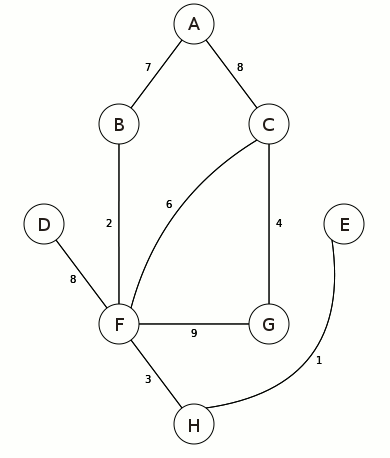

dijkstras-algorithm
===================

Implementations of Dijkstra's shortest path algorithm in different languages. 
Head over to http://maxburstein.com/blog/introduction-to-graph-theory-finding-shortest-path/ to learn about implementing Dijkstra's algorithm. 
You can also learn about unit testing by visiting http://maxburstein.com/blog/introduction-to-unit-testing-in-python-and-ruby/.

## Usage Example:

Each example should feature this graph and should print the path A->B->F->H in some format.
ex. `py dijkstras.py` >>> \['H', 'F', 'B'\]

## Current Supported Languages:
C++, C#, Java, Javascript, Typescript, Coffeescript, PHP, **Python**, **Ruby**, Scala, C, Go, Rust
*(Bolded languages have associated test-suites)*
